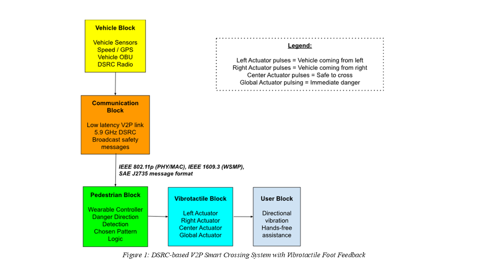
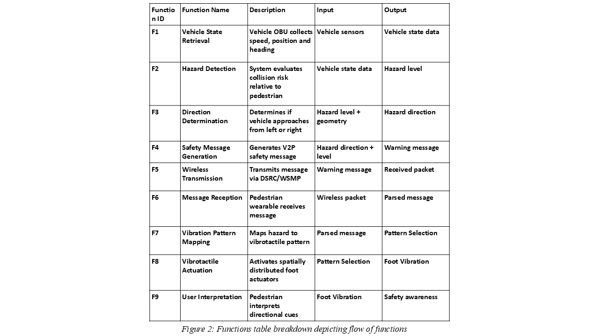
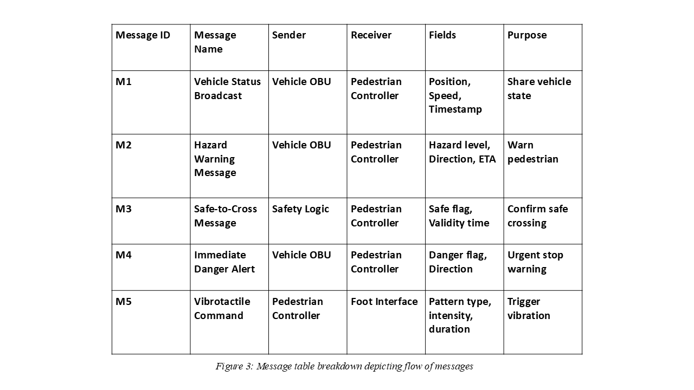

# CEG3006-V2P-Project
Smart Crossing System using DSRC based V2P safety system

## Table of Contents

1. [Project Overview](#1-project-overview)
2. [System Architecture](#2-system-architecture)
3. [Functions](#3-functions)
4. [Messages](#4-messages)
5. [AI Usage](#5-ai-usage)
6. [Individual Reflections](#6-individual-reflections)
7. [References](#7-references)

It is a Vehicle to Pedestrian (V2P) safety system created to aid visually impaired people at signal crossings.

## 1. Project Overview
## Abstract
A safety system leveraging Vehicle to Everything (V2X), consisting of a smart insole technology coupled with road infrastructure and vehicles on the road, with location-based vibration patterns to deliver discreet safety and navigation cues, offering a hands-free and audio-free assistive interface for visually impaired users.
## Literature Review
This project proposes a Vehicle-to-Pedestrian (V2P) safety system that integrates vehicular communication with a smart vibrotactile insole to enhance pedestrian safety, particularly for visually impaired users. The system uses vehicle onboard units (OBUs) to detect potential collision risks and transmit safety messages via low-latency V2X communication. These messages are received by a pedestrian’s smartphone relay and translated into directional vibration patterns delivered through actuators embedded in the insole. For example, vibrations on the left or right indicate approaching vehicles, while a full-sole pulse signals immediate danger. This provides a hands-free, silent, and intuitive interface that does not rely on vision or hearing, making it suitable for complex urban environments.
Existing research has demonstrated that vibrotactile feedback is an effective method for conveying navigation information. Studies on tactile-foot stimulation show that users can accurately interpret directional cues delivered through vibration, achieving recognition rates of up to 94%. (Velázquez et al., 2015) There is also research on vibrating footwear that shows spatial vibration patterns can convey directional information and achieve measurable perception accuracy in user studies, suggesting their potential for assisting navigation. (Xu et al., 2016).
Furthermore, existing research in haptic communication, such as V-Braille systems and Body-Braille devices, demonstrates that vibration-based interfaces can effectively convey information through touch (Jayant et al., 2010; Ohtsuka et al., 2013). More recent studies have explored foot-based tactile feedback, showing that users can distinguish vibration location, rhythm, and intensity (Morikawa & Ohtsuka, 2023). However, most existing solutions focus on text-based or high-density tactile encoding, which is less suitable for the foot's lower sensitivity.
In contrast, this project adopts a low-bandwidth, event-driven tactile vocabulary, using simple and intuitive vibration patterns for safety-critical alerts. By combining V2X communication with wearable haptic feedback, the proposed system offers a more practical, scalable, and user-friendly solution for real-time pedestrian safety. 

  

## 2. System Architecture

## 3. Functions

| Function ID | Function Name | Description | Input | Output |
|---|---|---|---|---|
| **F1** | Vehicle State Retrieval | Vehicle OBU collects speed, position, and heading from onboard sensors | Vehicle sensors (GPS, CAN bus) | Vehicle state data |
| **F2** | Hazard Detection | System evaluates collision risk and Time-to-Collision (TTC) relative to pedestrian position | Vehicle state data + pedestrian GPS | Hazard level (None / Low / High / Critical) |
| **F3** | Direction Determination | Determines whether vehicle approaches from left or right relative to pedestrian heading | Hazard level + relative geometry | Hazard direction (Left / Right / Front / Rear) |
| **F4** | Safety Message Generation | Generates a V2P BSM-based safety message with hazard level and direction fields | Hazard direction + level + ETA | Warning message (M2 or M4) |
| **F5** | Wireless Transmission | Transmits message over C-V2X PC5 at 5.9 GHz ITS band | Warning message | Received packet at pedestrian side |
| **F6** | Message Reception | Pedestrian smartphone receives and parses the C-V2X packet | Wireless packet | Parsed hazard message |
| **F7** | Vibration Pattern Mapping | Maps parsed hazard level and direction to the appropriate vibrotactile pattern in the codebook | Parsed message | Pattern selection (one of 4 patterns) |
| **F8** | Vibrotactile Actuation | Activates the selected ERM actuators in the insole via BLE command | Pattern selection | Physical foot vibration |
| **F9** | User Interpretation | Pedestrian interprets the spatial vibration cue and reacts accordingly | Foot vibration | Safety-aware pedestrian response |

Flow of functions

1. OBU receives the state of the vehicle
2. The collision risk is computed relative to the pedestrian
3. Direction of the hazard is determined
4. Safety message is sent
5. Message is sent using IEEE802.11p
6. Pedestrian smart insole gets the safety message
7. Corresponding vibration pattern is chosen
8. Vibrotactile actuators are activated
9. Pedestrian can evaluate the direction of hazard or if its safe to cross

## 4. Messages

| Message ID | Message Name | Sender | Receiver | Fields | Purpose |
|---|---|---|---|---|---|
| **M1** | Vehicle Status Broadcast | Vehicle OBU | Pedestrian Controller | Position (lat/lon), Speed (km/h), Heading (°), Timestamp (ms), MsgCount | Share raw vehicle state at 10 Hz |
| **M2** | Hazard Warning Message | Vehicle OBU | Pedestrian Controller | HazardLevel (enum), Direction (enum), ETA (ms), TTC (ms), VehicleID | Warn pedestrian of approaching hazard |
| **M3** | Safe-to-Cross Message | Safety Logic (Smartphone) | Pedestrian Controller (internal) | SafeFlag (bool), ValidityTime (ms) | Confirm crossing window is safe |
| **M4** | Immediate Danger Alert | Vehicle OBU | Pedestrian Controller | DangerFlag (bool), Direction (enum), TTC (ms) | Urgent stop — critical collision risk |
| **M5** | Vibrotactile Command | Pedestrian Controller (Smartphone) | Foot Interface (nRF52840 via BLE) | PatternType (enum), Intensity (0–255), Duration (ms), ActuatorMask (bitmask) | Trigger the correct vibration pattern on insole |

Flow of messages

1. A vehicle approaches the crossing zone
2. Vehicle OBU will broadcast vehicle status
3. Hazard detection logic determines collision risk
4. Hazard warning is sent using DSRC
5. Pedestrian smart insole will receive the message
6. Direction of hazard is identified
7. Vibrotactile pattern is selected
8. Actuators in insole provide vibration pattern according to direction
9. Pedestrian responds to safety cue.

## 5. AI Usage

## 6. Individual Reflections

Revanth: I was able to contribute to the proposed safety V2P crossing system through creating the system architecture. The architecture shows the integration of the DSRC communication protocol used by the vehicle OBU and how it interacts with the vibrotactile insole worn by visually impaired people to provide safe navigation cues and potential danger warnings. In addition, I created the functions table depicting the sequence of events from the intial receiving of the vehicle state to the activation of the vibrotactile insoles that provide pedestrians with a sense of direction of a potential hazard or provides safe cues to cross. I came up with the message table representing the communication between the vehicles, pedestrian worn vibrotactile insoles and the activation of corresponding actuators indicating direction of potential danger to warn pedestrians. A key challenge that was faced by me was making sure the system architecture, function and message tables were consistent to ensure the precise implementation of the solution and required several rounds of improvements. All in all, this project has provided an opportunity to come up with a solution to aid visually impaired people especially in the area of safe navigation at crossing junctions and ensure its implementation its practical and feasible for everyday use.

Yong Lun: My contributions was to brainstorm the initial solution to be less generic and more specific to a niche audience, which in this case is the visually impaired. I prompted AI with, attaching context of a few research papers that I find it interesting and focuses towards our intended audience. Using the AI suggestions coupled with my own researches, I decided to integrate existing research ideas together. The ideas I took inspirations from, was a study of how braille systems can be represented with smartphone haptic vibrations. Another study was how humans' foot soles are capable of detecting vibration patterns of body-braille. With these ideas combined, the final prototype I came up with was an insole that communicates with our original V2X system to encode simple messages into haptic vibrations for navigation assistance, hazard alerts for the visually impaired. With the help of AI, I was able to find out the strengths and weaknesses of the design, and how can it be implemented seamlessly with the V2X ecosystem. Conclusively, this project allows me to creatively explore new ideas with application of existing knowledge learned in CEG3006.

Ernest Tan: My primary contributions to this project were the decision log, the README documentation, and evaluating the AI-generated outputs throughout the process. Going into the project, I was already fairly comfortable using generative AI tools, so I took on the role of crafting and refining the prompts we used to accelerate our research and documentation. However, I quickly realised that even with prior experience, getting consistently useful outputs required far more deliberate effort than I had anticipated. Vague or broad prompts would return generic responses that sounded plausible but lacked the technical specificity our project needed. For example, early prompts about V2X communication technology returned confident comparisons with figures I could not verify against the actual IEEE 802.11p standard. This taught me that AI tools work best as a starting point rather than a final source, and that domain knowledge is essential to critically evaluate what they produce. I found that structuring the log chronologically also helped the team stay aligned on what had been decided which reduced repeated discussions. Overall, this project changed how I think about AI-assisted work and responsible use means treating every AI output as a draft that requires human verification, not a conclusion. I leave this project with a much stronger appreciation for the engineering discipline of V2X communication and the practical challenges of designing safety-critical systems for vulnerable road users.

Wiz: My contributions to this project were mainly focused on the literature review and research on hardware components, where I explored existing studies on vibrotactile feedback and how it can be used to convey directional information effectively. I worked on sections that looked at how users interpret vibration patterns through foot-based stimulation, including factors such as vibration intensity, rhythm, and spatial placement. By going through multiple research papers, I gained a better understanding of how these tactile cues can be designed and recognised reliably, with some studies showing high accuracy in navigation tasks. This helped me see how these concepts could be applied to support the feasibility of our proposed V2P system. For the hardware components, parameters, and real-world use case, I supported my teammates by reviewing and refining the content to ensure the system was technically consistent. I checked whether key parameters like DSRC latency (<100 ms), BLE delay (<10 ms), and actuator response time (<5 ms) made sense for a real-time safety system. I also made sure that the overall data flow—from vehicle broadcast, to smartphone processing, and finally to the vibrotactile feedback—was logical and aligned with the intended event-driven design and TTC thresholds. During this process, I used AI tools to help cross-check parameter ranges, understand whether the latency targets were realistic, and better visualise how the different components interact within the V2X system. I also reviewed the use case to ensure it reflected realistic behaviour, such as message frequency and response timing. One challenge I faced was making sure that the literature review was not just summarising research, but actually linked clearly to our system design. This meant translating research findings, like how accurately users can detect vibration patterns, into practical design choices such as actuator placement and vibration signals. Overall, this project helped me improve my ability to connect research with real system implementation and made me more confident in contributing to a technical, safety-focused engineering project.

## 7. References

[1]: Velázquez, R., Pissaloux, E., & Lay-Ekuakille, A. (2015). Tactile-Foot Stimulation Can Assist the Navigation of People with Visual Impairment. Applied Bionics and Biomechanics, 2015, 1–9. https://doi.org/10.1155/2015/798748

[2]: Xu, Q., Gan, T., Chia, S. C., Li, L., Lim, J.-H., & Kyaw, P. (2016). Design and evaluation of vibrating footwear for navigation assistance to visually impaired people. In Proceedings of the IEEE International Conference on Internet of Things (iThings) (pp. 305–310). https://doi.org/10.1109/iThings-GreenCom-CPSCom-SmartData.2016.75

[3]: Jayant, C., Acuario, C., Johnson, W., Hollier, J., & Ladner, R. (2010). V-braille: haptic braille perception using a touch-screen and vibration on mobile phones. Proceedings of the 12th International Acm Sigaccess Conference on Computers and Accessibility, 295–296. https://doi.org/10.1145/1878803.1878878

[4]: Morikawa, Y., & Ohtsuka, S. (2023). Vibration Patterns for Body-Braille Using a Foot Sole Tactile Sensation. IEEE Global Conference on Consumer Electronics, 1065–1066. https://doi.org/10.1109/GCCE59613.2023.10315479

[5]: Ohtsuka, S., Tomizawa, T., Hasegawa, S., Sasaki, N., & Harakawa, T. (2013, October). Introduction of a wireless Body-Braille device and a self-learning system. 2013 IEEE 2nd Global Conference on Consumer Electronics (GCCE), Article 6664872. https://doi.org/10.1109/GCCE.2013.6664872

[6]:  Barontini, F. (2025). Wearable Haptic Devices for Realistic Scenario Applications (1st ed. 2025.). Springer Nature Switzerland. https://doi.org/10.1007/978-3-031-70539-7

