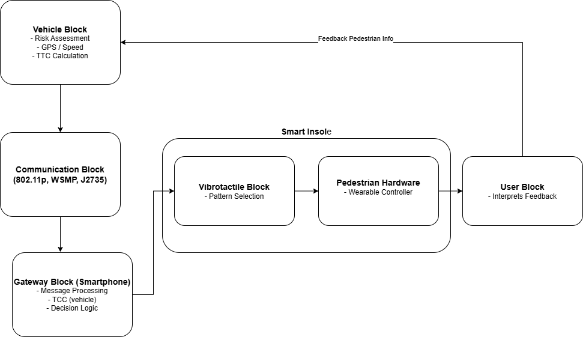
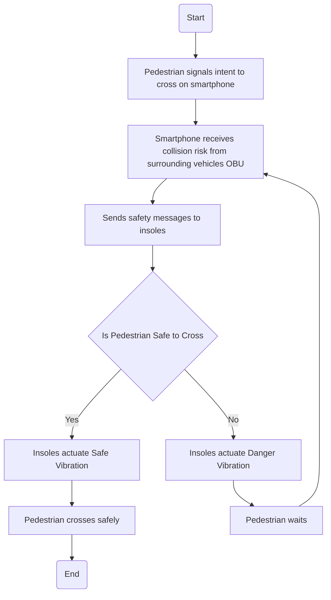

# CEG3006-V2P-Project-Group 5
Smart Crossing System using DSRC based V2P safety system

## Table of Contents

1. [Project Overview](#1-project-overview)
2. [System Architecture](#2-system-architecture)
3. [Overall Flow of Events](#3-overall-flow-of-events)
4. [Functions](#4-functions)
5. [Messages](#5-messages)
6. [Hardware Components and Parameters](#6-hardware-components-and-parameters)
7. [Use Case](#7-use-case)
8. [AI Usage](#8-ai-usage)
9. [Individual Reflections](#9-individual-reflections)
10. [References](#10-references)

It is a Vehicle to Pedestrian (V2P) safety system created to aid visually impaired people at signal crossings.

## 1. Project Overview
## 1.1 Abstract
A smart safety system leveraging Vehicle to Pedestrian (V2P), consisting of a smart insole technology coupled with road infrastructure and vehicles on the road, with location-based vibration patterns to deliver discreet safety and navigation cues, offering a seamless and efficient assistive interface for visually impaired users.
## 1.2 Literature Review
This project proposes a Vehicle-to-Pedestrian (V2P) safety system that integrates vehicular communication with a smart vibrotactile insole to enhance pedestrian safety, particularly for visually impaired users. The system uses vehicle onboard units (OBUs) to detect potential collision risks and transmit safety messages via low-latency V2X communication. These messages are received by a pedestrian’s smartphone relay and translated into directional vibration patterns delivered through actuators embedded in the insole. For example, vibrations on the left or right indicate approaching vehicles, while a full-sole pulse signals immediate danger. This provides a hands-free, silent, and intuitive interface that does not rely on vision or hearing, making it suitable for complex urban environments.
Existing research has demonstrated that vibrotactile feedback is an effective method for conveying navigation information. Studies on tactile-foot stimulation show that users can accurately interpret directional cues delivered through vibration, achieving recognition rates of up to 94%. (Velázquez et al., 2015) There is also research on vibrating footwear that shows spatial vibration patterns can convey directional information and achieve measurable perception accuracy in user studies, suggesting their potential for assisting navigation. (Xu et al., 2016).
Furthermore, existing research in haptic communication, such as V-Braille systems and Body-Braille devices, demonstrates that vibration-based interfaces can effectively convey information through touch (Jayant et al., 2010; Ohtsuka et al., 2013). More recent studies have explored foot-based tactile feedback, showing that users can distinguish vibration location, rhythm, and intensity (Morikawa & Ohtsuka, 2023). However, most existing solutions focus on text-based or high-density tactile encoding, which is less suitable for the foot's lower sensitivity.
In contrast, this project adopts a low-bandwidth, event-driven tactile vocabulary, using simple and intuitive vibration patterns for safety-critical alerts. By combining V2X communication with wearable haptic feedback, the proposed system offers a more practical, scalable, and user-friendly solution for real-time pedestrian safety. 

  

## 2. System Architecture

## 3. Overall Flow of Events

## 4. Functions

| Function ID | Function Name | Description | Input | Output |
|---|---|---|---|---|
| `F1` | Vehicle State Retrieval | Vehicle OBU collects speed, position, and heading from onboard sensors | Vehicle sensors (GPS, CAN bus) | Vehicle state data |
| `F2` | Hazard Detection | System evaluates collision risk and Time-to-Collision (TTC) relative to pedestrian position | Vehicle state data + pedestrian GPS | Hazard level (None / Low / High / Critical) |
| `F3` | Direction Determination | Determines whether vehicle approaches from left or right relative to pedestrian heading | Hazard level + relative geometry | Hazard direction (Left / Right / Front / Rear) |
| `F4` | Safety Message Generation | Generates a V2P BSM-based safety message with hazard level and direction fields | Hazard direction + level + ETA | Warning message (M2 or M4) |
| `F5` | Wireless Transmission | Transmits message over DSRC / IEEE 802.11p at 5.9 GHz ITS band | Warning message | Received packet at pedestrian side |
| `F6` | Message Reception | Pedestrian smartphone receives and parses the DSRC packet | Wireless packet | Parsed hazard message |
| `F7` | Vibration Pattern Mapping | Maps parsed hazard level and direction to the appropriate vibrotactile pattern in the codebook | Parsed message | Pattern selection (one of 4 patterns) |
| `F8` | Vibrotactile Actuation | Activates the selected LRA actuators in the insole via BLE command | Pattern selection | Physical foot vibration |
| `F9` | User Interpretation | Pedestrian interprets the spatial vibration cue and reacts accordingly | Foot vibration | Safety-aware pedestrian response |

Flow of functions

1. OBU receives the state of the vehicle
2. The collision risk is computed relative to the pedestrian
3. Direction of the hazard is determined
4. Safety message is sent
5. Message is sent using IEEE802.11p
6. Pedestrian smart insole gets the safety message
7. Corresponding vibration pattern is chosen
8. Vibrotactile actuators are activated
9. Pedestrian can evaluate the direction of hazard or if its safe to cross

## 5. Messages

| Message ID | Message Name | Sender | Receiver | Fields | Purpose |
|---|---|---|---|---|---|
| `M1` | Vehicle Status Broadcast | Vehicle OBU | Pedestrian Controller | Position (lat/lon), Speed (km/h), Heading (°), Timestamp (ms), MsgCount | Share raw vehicle state at 10 Hz |
| `M2` | Hazard Warning Message | Vehicle OBU | Pedestrian Controller | HazardLevel (enum), Direction (enum), ETA (ms), TTC (ms), VehicleID | Warn pedestrian of approaching hazard |
| `M3` | Safe-to-Cross Message | Safety Logic (Smartphone) | Pedestrian Controller (internal) | SafeFlag (bool), ValidityTime (ms) | Confirm crossing window is safe |
| `M4` | Immediate Danger Alert | Vehicle OBU | Pedestrian Controller | DangerFlag (bool), Direction (enum), TTC (ms) | Urgent stop — critical collision risk |
| `M5` | Vibrotactile Command | Pedestrian Controller (Smartphone) | Foot Interface (nRF52840 via BLE) | PatternType (enum), Intensity (0–255), Duration (ms), ActuatorMask (bitmask) | Trigger the correct vibration pattern on insole |

Flow of messages

1. A vehicle approaches the crossing zone
2. Vehicle OBU will broadcast vehicle status
3. Hazard detection logic determines collision risk
4. Hazard warning is sent using DSRC
5. Pedestrian smart insole will receive the message
6. Direction of hazard is identified
7. Vibrotactile pattern is selected
8. Actuators in insole provide vibration pattern according to direction
9. Pedestrian responds to safety cue.

## 6. Hardware Components and Parameters

This section provides a detailed breakdown of the system’s hardware architecture and operational parameters. It includes the core embedded components, communication protocols (IEEE 802.11p, IEEE 1609, WSMP, SAE J2735), and performance metrics such as latency, communication range, and power consumption. These specifications highlight how the system meets real-time safety requirements for Vehicle-to-Pedestrian (V2P) applications.

---

## Hardware Components

| Module | Component | Description | Key Specs / Notes |
|--------|----------|------------|------------------|
| Microcontroller | Nordic nRF52840 | Main controller with BLE | Ultra-low power, BLE 5, wearable-friendly |
| Haptic Driver | TI DRV2605L | Drives vibration actuators | Supports LRA, built-in haptic library |
| Actuators | LRA Vibration Motors | Provides tactile feedback | Fast response, precise patterns |
| Motion Sensor | Bosch BMA400 | Detects movement / wake-up | Ultra-low power accelerometer |
| Pressure Sensors | FSR / FlexiForce Sensors | Detect foot pressure distribution | Used for intent detection & gait analysis |
| Wireless Gateway | Smartphone (BLE + V2X bridge) | Handles V2P communication | Runs app for logic & message processing |
| Power Management | TI BQ24074 | Battery charging & power path | Li-Po support, power-path control |
| Battery Gauge | MAX17048 | Battery level monitoring | Low-power fuel gauge |
| Power Source | Li-Po Battery (100–300 mAh) | Main energy source | Designed for all-day usage |
| Communication Module | DSRC / C-V2X (via gateway/OBU) | Enables V2P communication | Operates at 5.9 GHz ITS band |

---

## Communication & System Parameters

| Parameter | Value | Description |
|----------|------|------------|
| Communication Type | V2P (Vehicle-to-Pedestrian) | Pedestrian ↔ Vehicle / Infrastructure |
| Wireless Protocol | IEEE 802.11p (DSRC) | Low-latency vehicular communication |
| WAVE Stack | IEEE 1609 | Networking & messaging framework |
| Message Protocol | WSMP | Fast safety message delivery |
| Message Format | SAE J2735 | Standardized safety message structure |
| Frequency Band | 5.9 GHz | ITS dedicated spectrum |
| Channel | Control Channel (CCH) | Safety-critical communication |
| Communication Range | 100–300 m (~200 m typical) | Urban DSRC coverage |
| End-to-End Latency | < 150 ms | Real-time safety requirement |
| Message Frequency | 1–10 Hz (configurable) | Broadcast rate |
| Data Rate | ~3–27 Mbps (802.11p) | Physical layer capability |
| Effective Bandwidth Usage | Low | Small safety message payloads |
| Packet Size | ~50–300 bytes | Typical WSM payload |

---

## Smart Insole Parameters

| Parameter | Value | Description |
|----------|------|------------|
| Number of Actuators | 4–6 | Enables spatial feedback |
| Feedback Type | Vibrotactile (LRA) | Silent, non-visual guidance |
| Response Time | < 50 ms | Trigger to vibration delay |
| Power Consumption (Idle) | < 1 mA | Low-power sleep mode |
| Power Consumption (Active) | 10–100 mA (burst) | During vibration + BLE |
| Battery Life | ~8–12 hours | Depends on usage frequency |
| Communication (Insole ↔ Phone) | BLE | Low energy communication |
| Wake-Up Mechanism | Motion / pressure-triggered | Improves power efficiency |

---

## Safety & Detection Parameters

| Parameter | Value | Description |
|----------|------|------------|
| Collision Metric | Time-To-Collision (TTC) | Core risk evaluation |
| TTC Threshold | 2–5 seconds (configurable) | Determines danger level |
| Detection Inputs | Distance + velocity | Used for TTC calculation |
| Update Rate | ~10 Hz | Real-time monitoring |
| Alert Types | Directional + urgency-based | Encoded via vibration |

---

## System Capabilities

| Capability | Description |
|-----------|------------|
| Real-Time Safety | Alerts generated within <150 ms |
| Accessibility | Designed for visually impaired users |
| Hands-Free Operation | No audio or visual reliance |
| Low Power | Optimized for all-day wearable use |
| Scalable | Compatible with DSRC and future C-V2X |

## 7. Use Case

Ahmad is a visually impaired student who crosses a busy signalised intersection near his university every morning. He wears a smart insole embedded with four LRA vibrotactile actuators in each shoe, connected via Bluetooth 5.0 LE to a smartphone controller with a DSRC radio operating at 5.9 GHz.

As Ahmad approaches the kerb, his controller begins listening for Vehicle Status Messages broadcast by nearby vehicles over the Control Channel at 5.9 GHz. A bus approaching from the right at 50 km/h continuously transmits Vehicle Status Messages (M1). Upon detecting a pedestrian in the crossing zone, the vehicle’s OBU computes the Time-to-Collision (TTC) and detects a high collision risk. Within 150 ms, it sends a Hazard Warning Message (M2) indicating danger from the right.

Ahmad’s smartphone processes the message and sends a Vibrotactile Command (M5) via BLE to the insole in under 10 ms. BLE operates at 2.4 GHz with low latency, enabling fast and reliable communication. Ahmad feels distinct pulses under the right side of his foot and steps back. Once the danger passes, a Safe-to-Cross Message triggers a centre vibration. The full response cycle completes within 100 ms, ensuring timely and intuitive guidance.

## 8. AI Usage

### AI Tools Used
Throughout this project, AI tools such as ChatGPT were used to support different phases of the development process. During the literature review phase, AI was used to help me understand many technical concepts such as vibrotactile feedback, haptic communication, and human perception of vibration patterns. This helped to speed up the understanding of how different vibration parameters, including intensity, rhythm, and spatial placement, affect user perception.

In terms of system design and technical validation, AI was used to cross-check important parameters such as DSRC latency, BLE communication delay, actuator response time, and overall end-to-end latency. It also helped to explain how different components within the V2X communication stack interact with one another, allowing for better validation of whether the proposed system meets real-time safety requirements.

For the hardware components and real-world use case, AI assisted in reviewing the consistency of hardware specifications and communication parameters. This ensured that values such as transmission rate, communication range, and latency were realistic and aligned with the intended system behaviour. AI was also used to refine the use case scenario to ensure that the data flow was logical and clearly explained.

Lastly, AI was used to support in our writeup so that our content can be clear, coherent, easy to understand while maintaining technical accuracy.

| Tool | Project Phase | How It Was Used |
|------|--------------|-----------------|
| ChatGPT | Research & Ideation (Early March) | Surveying existing V2P literature; brainstorming wearable form factors |
| Gemini AI | Design & Architecture (Mid March) | Suggesting relay architecture; drafting vibration pattern language; flagging privacy considerations |
| Claude | Validation & Documentation (Late March) | Drafting latency budget tables; actuator comparisons; filter logic for false positive reduction; decision log write-up |

---

### Examples of Prompts and Generated Outputs

**Prompt 1 — Literature Survey (ChatGPT)**
> *"What existing Vehicle-to-Pedestrian (V2P) safety applications exist, and how do they warn pedestrians of danger? Focus on wearable or haptic approaches."*

**Output summary:** ChatGPT returned an overview of smartphone-based V2P alert apps, audio-based warning systems, and a brief mention of haptic wristbands in research prototypes. It identified that most existing solutions rely on visual or audio alerts, leaving a gap for users who are visually impaired or wearing headphones.

**How we verified it:** We cross-checked the cited solutions against Google Scholar and IEEE Xplore. The general landscape was accurate, but one referenced paper ("HaptiCross, 2021") could not be found in any database and appeared to be fabricated.

---

**Prompt 2 — Latency Budget (Gemini)**
> *"For a V2P safety system using DSRC / IEEE 802.11p with a smartphone relay and BLE connection to a haptic insole, estimate the end-to-end latency budget breakdown and determine whether it is safe for a pedestrian at a crossing with vehicles travelling at 50 km/h."*

**Output summary:** Gemini produced a latency breakdown (802.11p ~50 ms, smartphone processing ~50 ms, BLE relay ~10 ms, app logic ~20 ms, total ~130 ms) and calculated that at 50 km/h a vehicle covers ~14 m/s, requiring at least ~1.5 s of pedestrian reaction time. It concluded that 130 ms was well within a safe 500 ms budget.

**How we verified it:** The 802.11p transmission latency figure was verified against ETSI EN 302 663. The BLE latency estimate was checked against the published Bluetooth 5.0 specification. The vehicle kinematics calculation was independently redone by the team and confirmed correct.

---

**Prompt 3 — Actuator Selection (Claude)**
> *"Compare eccentric rotating mass (ERM) motors, linear resonant actuators (LRA), and piezoelectric actuators for use in a haptic insole that must fit inside a shoe, run on a small battery, and produce distinct vibration pulses with fast response times."*

**Output summary:** Claude recommended LRAs due to their faster response time (~10 ms vs ~50 ms for ERMs), lower power draw, and suitability for repeatable pulse patterns. It flagged that piezoelectric actuators require high driving voltages (100–200 V) incompatible with a small LiPo cell, and that ERMs suffer from spin-up delay making them poorly suited for sharp, distinct pulses.

**How we verified it:** Response time figures for LRAs were confirmed using a Texas Instruments application note on haptic actuator selection. The piezoelectric voltage requirement was verified against component datasheets from Murata.

---

### Identified Weaknesses and Hallucinations

**Hallucination 1 — Fabricated Academic Reference (ChatGPT)**

During the literature survey, ChatGPT cited a paper titled *"HaptiCross: Haptic Feedback for Safe Pedestrian Crossings"* (2021) as evidence for haptic wearables in V2P research. When we searched IEEE Xplore, ACM Digital Library, and Google Scholar, no such paper could be found. This is a well-documented failure mode of large language models — generating plausible-sounding but entirely fictitious citations. **Correction:** We discarded the reference and replaced it with real papers found directly through IEEE Xplore.

---

**Hallucination 2 — Incorrect Communication Technology Recommendation (Gemini)**

When asked to recommend a V2P communication technology, Gemini initially recommended C-V2X (PC5 sidelink) as the superior choice and stated it was "already widely deployed in consumer smartphones as of 2023." This was factually inaccurate as C-V2X chipsets remain uncommon in consumer devices and require specialised hardware. The claim was not supported by any manufacturer specification or standards document. **Correction:** The team independently researched both DSRC and C-V2X deployment status and selected DSRC / IEEE 802.11p based on its more mature ecosystem and infrastructure independence.

---

**Hallucination 3 — Overconfident Power Estimate (Claude)**

When asked to estimate battery life for the insole, Claude initially stated the system would draw "approximately 3–4 mA average" from the BLE module, implying a 200 mAh battery would last over 50 hours. This figure was inconsistent with real-world BLE power consumption. **Correction:** The team validated the estimate against the Nordic Semiconductor nRF52 datasheet, which showed average current draw closer to 8 mA under the duty-cycling parameters we specified (~25 hours of battery life), still meeting our 8-hour target but significantly different from Claude's initial estimate.

## 9. Individual Reflections

Revanth: I was able to contribute to the proposed safety V2P crossing system through creating the system architecture. The architecture shows the integration of the DSRC communication protocol used by the vehicle OBU and how it interacts with the vibrotactile insole worn by visually impaired people to provide safe navigation cues and potential danger warnings. In addition, I created the functions table depicting the sequence of events from the intial receiving of the vehicle state to the activation of the vibrotactile insoles that provide pedestrians with a sense of direction of a potential hazard or provides safe cues to cross. I came up with the message table representing the communication between the vehicles, pedestrian worn vibrotactile insoles and the activation of corresponding actuators indicating direction of potential danger to warn pedestrians. A key challenge that was faced by me was making sure the system architecture, function and message tables were consistent to ensure the precise implementation of the solution and required several rounds of improvements. All in all, this project has provided an opportunity to come up with a solution to aid visually impaired people especially in the area of safe navigation at crossing junctions and ensure its implementation its practical and feasible for everyday use.

Yong Lun: My contributions was to brainstorm the initial solution to be less generic and more specific to a niche audience, which in this case is the visually impaired. This includes weighing the pros and cons of each potential component and hand-picking the best hardware components for our use-cases. Lastly, I am also responsible for adding markdowns to tables, and creating the flowcharts to illustrate the overall flow of the our system. To accelerate my tasks, I prompted AI in addition with attaching context of a few research papers that I find it interesting which focuses on our intended audience. Using the AI suggestions coupled with my own research, I decided to integrate existing studied ideas together. The ideas I took inspirations from, was a study of how braille systems can be represented with smartphone haptic vibrations. Another study was how humans' foot soles are capable of detecting vibration patterns of body-braille. With these ideas combined, the final prototype I came up with was an insole that communicates with our original V2P system to encode simple messages into haptic vibrations for navigation assistance and hazard alerts for the visually impaired. With the help of AI, I was able to find out the strengths and weaknesses of the design, and how can it be implemented seamlessly with the V2P ecosystem. Conclusively, this project allows me to creatively explore new ideas for applications with my existing knowledge learned in CEG3006.

Ernest: My primary contributions to this project were the decision log, the README documentation, and evaluating the AI-generated outputs throughout the process. Going into the project, I was already fairly comfortable using generative AI tools, so I took on the role of crafting and refining the prompts we used to accelerate our research and documentation. However, I quickly realised that even with prior experience, getting consistently useful outputs required far more deliberate effort than I had anticipated. Vague or broad prompts would return generic responses that sounded plausible but lacked the technical specificity our project needed. For example, early prompts about V2X communication technology returned confident comparisons with figures I could not verify against the actual IEEE 802.11p standard. This taught me that AI tools work best as a starting point rather than a final source, and that domain knowledge is essential to critically evaluate what they produce. I found that structuring the log chronologically also helped the team stay aligned on what had been decided which reduced repeated discussions. Overall, this project changed how I think about AI-assisted work and responsible use means treating every AI output as a draft that requires human verification, not a conclusion. I leave this project with a much stronger appreciation for the engineering discipline of V2X communication and the practical challenges of designing safety-critical systems for vulnerable road users.

Wiz: My contributions to this project were mainly focused on the literature review and research on hardware components, where I explored existing studies on vibrotactile feedback and how it can be used to convey directional information effectively. I worked on sections that looked at how users interpret vibration patterns through foot-based stimulation, including factors such as vibration intensity, rhythm, and spatial placement. By going through multiple research papers, I gained a better understanding of how these tactile cues can be designed and recognised reliably, with some studies showing high accuracy in navigation tasks. This helped me see how these concepts could be applied to support the feasibility of our proposed V2P system. For the hardware components, parameters, and real-world use case, I supported my teammates by reviewing and improving the content to ensure the system was technically consistent and fulfills real-life safety needs. I checked whether key parameters like DSRC latency (<100 ms), BLE delay (<10 ms), and actuator response time (<5 ms) made sense for a real-time safety system. I also made sure that the overall data flow, from vehicle broadcast, to smartphone processing, and then to the vibrotactile feedback, was logical. During this process, I used AI tools to help cross-check parameter ranges, understand whether the latency targets were realistic, and better visualise how the different components interact within the V2X system. I also reviewed the use case to ensure it reflected realistic behaviour, such as message frequency and response timing. One challenge I faced was making sure that the literature review was actually linked clearly to our system design. This meant taking what I learned from the research, such as how well users can recognise vibration patterns, and applying it to actual design decisions like where to place the actuators and how the vibration signals should feel. Overall, this project helped me improve my ability to connect research with real system implementation and made me more confident in contributing to a safety-oriented engineering project.

Peng Hui: During the conceptualization of the system, my contributions focused heavily on defining the technical constraints and performance budgets required for a real-time safety system. I worked closely on evaluating our V2P communication options, assisting in the selection of DSRC over C-V2X to ensure reliable, low-latency message delivery. A major part of my ideation effort was establishing the end-to-end latency budget. I helped calculate the vehicle kinematics and reaction times, determining that our system needed to operate well under a 500 ms threshold to provide a meaningful warning to pedestrians. Additionally, I contributed to the power management conceptualization, helping design the aggressive BLE duty cycling strategy. This ensured our proposed insole could realistically achieve an 8-hour battery life without compromising the speed of safety alerts.

## 10. References

[1]: Velázquez, R., Pissaloux, E., & Lay-Ekuakille, A. (2015). Tactile-Foot Stimulation Can Assist the Navigation of People with Visual Impairment. Applied Bionics and Biomechanics, 2015, 1–9. https://doi.org/10.1155/2015/798748

[2]: Xu, Q., Gan, T., Chia, S. C., Li, L., Lim, J.-H., & Kyaw, P. (2016). Design and evaluation of vibrating footwear for navigation assistance to visually impaired people. In Proceedings of the IEEE International Conference on Internet of Things (iThings) (pp. 305–310). https://doi.org/10.1109/iThings-GreenCom-CPSCom-SmartData.2016.75

[3]: Jayant, C., Acuario, C., Johnson, W., Hollier, J., & Ladner, R. (2010). V-braille: haptic braille perception using a touch-screen and vibration on mobile phones. Proceedings of the 12th International Acm Sigaccess Conference on Computers and Accessibility, 295–296. https://doi.org/10.1145/1878803.1878878

[4]: Morikawa, Y., & Ohtsuka, S. (2023). Vibration Patterns for Body-Braille Using a Foot Sole Tactile Sensation. IEEE Global Conference on Consumer Electronics, 1065–1066. https://doi.org/10.1109/GCCE59613.2023.10315479

[5]: Ohtsuka, S., Tomizawa, T., Hasegawa, S., Sasaki, N., & Harakawa, T. (2013, October). Introduction of a wireless Body-Braille device and a self-learning system. 2013 IEEE 2nd Global Conference on Consumer Electronics (GCCE), Article 6664872. https://doi.org/10.1109/GCCE.2013.6664872

